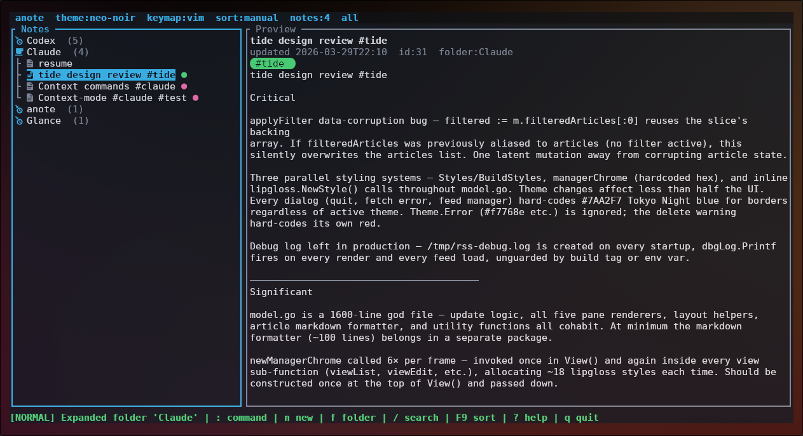

# anote

Keyboard-first TUI note-taking app in Rust.



## Features

- SQLite-backed notes with FTS5 full-text search
- Markdown preview with syntax highlighting in code blocks
- Inline spell/grammar linting (harper-core) with one-key fixes
- In-note find with live match highlighting and two-phase navigation
- Folders, tags, pin, archive
- Vim and default keymaps
- Three themes: neo-noir, paper, matrix
- Collapsible notes pane with scrollable preview
- Soft-delete trash and quick note switcher
- Quoted file paths in TUI import/export, search snippets, tag browser
- Tag browser can create tags and assign persistent custom colors
- Bulk note actions, empty-trash command, preview search highlighting
- Command palette (`:`), quick CLI capture, CLI search

## Installation

```bash
curl -fsSL https://raw.githubusercontent.com/allisonhere/anote/master/install.sh | bash
```

Installs to `~/.local/bin` (or `/usr/local/bin`). Override the location:

```bash
ANOTE_INSTALL_DIR=/usr/local/bin curl -fsSL https://raw.githubusercontent.com/allisonhere/anote/master/install.sh | bash
```

Supported platforms: Linux and macOS, x86_64 and aarch64.

## Build from source

```bash
cargo build --release
```

Run TUI:

```bash
cargo run
# or
cargo run -- tui
```

Quick capture:

```bash
cargo run -- capture "Ship the parser"
cargo run -- capture -t "Idea" "Use WAL + background indexing"
```

Search:

```bash
cargo run -- search "Ship"
```

## Data directory

- Linux default: `~/.local/share/anote/`
- Falls back to `./.anote/`

Override:

```bash
ANOTE_DATA_DIR=/path/to/data cargo run
```

## Config file

- Linux default: `~/.config/anote/config.toml`
- Falls back to `./.anote/config.toml`

Override:

```bash
ANOTE_CONFIG_PATH=/path/to/config.toml cargo run
```

### Options

```toml
theme   = "neo-noir"   # neo-noir | paper | matrix
keymap  = "default"    # default | vim
density = "cozy"       # cozy | compact
sort    = "manual"     # manual | updated | title
```

All fields are optional — missing fields fall back to the defaults above. The config file also stores the last-open note automatically so the TUI can restore your place on startup. Changes to `theme`, `keymap`, and `sort` can also be made at runtime via `:theme <name>`, `:keymap <name>`, and `:sort <mode>` in the command palette.

## TUI keybindings

### Primary flows

| Task | Primary path |
|------|--------------|
| Edit a note | select it, then `Enter` |
| Jump to a note | `Ctrl+P` |
| Search notes | `/` |
| Browse tags | `g` |
| Browse archive / trash | `A` / `T` |
| Bulk actions | `x` to mark, then act |

### Normal mode

| Key | Action |
|-----|--------|
| `j` / `k` or `↑` / `↓` | navigate notes |
| `n` | new note |
| `e` or `Enter` | open note in editor |
| `d d` | delete note |
| `/` | search / filter notes |
| `:` | power tools / command palette |
| `\` | toggle notes pane |
| `Ctrl+P` | quick switcher |
| `g` | browse and manage tags |
| `x` | toggle note selection |
| `*` | select all visible notes |
| `u` | clear selection |
| `p` | pin selected notes or toggle current note |
| `a` | archive selected/current note |
| `A` | open archive browser |
| `T` | open trash browser |
| `D` | move selected note(s) to trash |
| `r` | reload notes |
| `?` | help overlay |
| `q` | quit |
| `F6` | cycle theme |
| `F7` | cycle keymap |
| `F9` | cycle sort mode |

### Collapsed pane (preview only)

| Key | Action |
|-----|--------|
| `j` / `k` or `↑` / `↓` | scroll preview one line |
| `PgDn` / `PgUp` | scroll preview fast |

### Edit mode

| Key | Action |
|-----|--------|
| `Esc` | exit to preview |
| `Ctrl+S` | save |
| `Ctrl+Z` / `Ctrl+Y` | undo / redo |
| `Ctrl+C` / `Ctrl+X` | copy / cut |
| `Ctrl+V` | paste from clipboard |
| `Ctrl+F` | find in note |
| `Ctrl+L` | run spell/grammar lint |
| `Tab` | apply first lint suggestion at cursor |
| `]` / `[` | jump to next / prev lint |

### Find mode (Ctrl+F, default keymap)

Type freely to build the query — all characters including `n`/`N` go into the search term. Matches highlight live.

| Key | Action |
|-----|--------|
| `↓` / `↑` | next / prev match while typing |
| `Enter` or `Tab` | commit query → navigation phase |
| `Esc` | cancel find |

Navigation phase (after Enter):

| Key | Action |
|-----|--------|
| `n` / `↓` | next match |
| `N` / `↑` | prev match |
| `Enter` | enter edit mode at current match |
| `Backspace` | return to typing phase |
| any char | restart typing with that character |
| `Esc` | close find |

### Search (/ to enter)

| Token | Effect |
|-------|--------|
| `#tag` | filter by tag |
| `/folder` | filter by folder |
| plain text | full-text search |

### Tag browser (`g` or `:tags`)

| Key | Action |
|-----|--------|
| `j` / `k` or `↑` / `↓` | move through tags |
| `Enter` | filter notes by selected tag |
| `n` | create a new tag |
| `c` / `e` | choose a color for selected tag |
| `D` | delete the tag from all notes, with confirmation |
| `Esc` | close browser or cancel tag editing |

## Trash / Archive

| Key / Command | Action |
|---------------|--------|
| `a` | archive the selected or current note |
| `A` | open archive browser |
| `T` | open trash browser |
| `D` | move selected note(s) to trash |
| `j` / `k` or `↑` / `↓` | move in archive or trash browser |
| `U` | unarchive in archive browser |
| `D` | move archived note to trash in archive browser |
| `R` | restore in trash browser |
| `P` | purge in trash browser |
| `x` / `*` / `u` | mark / all / clear inside archive or trash browser |
| typing / `Backspace` | live-filter archive or trash browser results |

### Vim keymap extras

| Key | Action |
|-----|--------|
| `h` `j` `k` `l` | move cursor |
| `i` / `a` | enter insert mode |
| `v` | visual select |
| `y` / `d` | yank / delete |
| `p` / `P` | paste from system clipboard |
| `u` / `Ctrl+R` | undo / redo |
| `l` (normal mode) | open selected note from notes pane |

## Power tools (`:`)

| Command | Description |
|---------|-------------|
| `:new` | create a new note |
| `:import <path...>` | import file(s) as notes; quote paths with spaces |
| `:export <path>` | export the current note; quote paths with spaces |
| `:edit` | open note in editor |
| `:folder <name>` | move note to folder (blank = remove) |
| `:pin` / `:unpin` | pin note to top of list |
| `:search <query>` | run a search programmatically |
| `:theme <name>` | `neo-noir` \| `paper` \| `matrix` |
| `:keymap <name>` | `default` \| `vim` |
| `:sort <mode>` | `manual` \| `updated` \| `title` |
| `:tags` | browse and manage tags |
| `:archive` / `:archive!` | arm archive confirmation / archive immediately |
| `:unarchive` | unarchive the current note |
| `:archived` / `:trash` | open archive / trash browser |
| `:restore` / `:purge` | restore or permanently delete the current trashed note |
| `:empty-trash` | permanently delete all trashed notes |
| `:reload` | refresh note list |
| `:w` | save |
| `:wq` / `:x` | save and quit |
| `:q` / `:quit` | quit |

## Tags

Write `#tagname` on the first line of a note — tags are extracted automatically and searchable with `#tag` in the search bar.

Open the tag browser with `g` or `:tags`, then use `n` to create a tag, `c` or `e` to choose its color, and `D` to remove a tag from every note that uses it. Created tags can exist before they are applied to a note, and chosen colors persist across restarts.

Tags are displayed as colored pills in the note header, quick switcher, and tag browser. The pill caps use Nerd Font powerline glyphs (`\uE0B6`/`\uE0B4`) — install a [Nerd Font](https://www.nerdfonts.com/) and set it as your terminal font for the best appearance.
